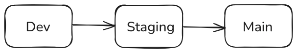

# Branching

[!badge variant="success" text="Latest"]

This page is dedicated to explaining the development workflow and important key points associated with different branches and moving the code between them.

## Dev

The development branch is designated for active development and testing activities outside of the local environment. It serves as the primary platform for implementing new features, enhancements, and bug fixes, while ensuring that services remain operational.

This branch is characterized by frequent updates and iterations, which may include incomplete or unstable code. As it is primarily intended for development purposes, the code within this branch is not accessible to end-users. 

## Staging

The staging branch serves as a pre-production environment that closely replicates the production setup, code pushed here should meet the same standards, as the code in production. Once features have been developed and tested in the `dev` branch with 100% code coverage, they are merged into the staging branch for additional testing. This branch is utilized for ensuring that all new changes function as intended while maintaining compatibility with existing features and also to make it accessible for the client to test the product in a controlled environment.

## Main

The main branch represents the live production environment where the application is accessible to end-users. This branch is of paramount importance and is maintained with a strong emphasis on stability, reliability, and security.

